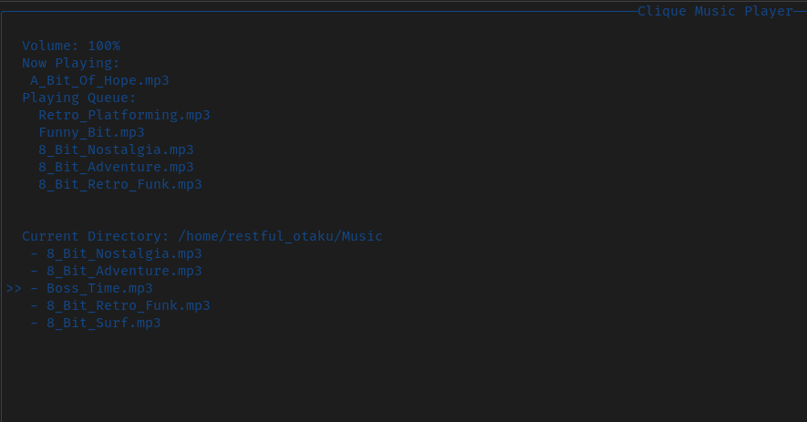

# Clique 

A simple CLI music player written in rust and ratatui

Add files to the `~/[user_name]/Music` directory to see music files

Build and Run: `cargo build --release && cargo run`

Have fun!

### Keys

- `up_arrow` scroll up_arrow

- `down_arrow` scroll_down

- `left_arrow` go to previous directory ".."

- `right_arrow` go to directory / play

- `space` play / stop

- `0-9` play the song at index

- `+` raise volume

- `-` lower volume

- `q` or `esc` to quit

- `s` skip song 

- `r` remove from queue

### Features

- [x] Automatically find and use ~/$USER/Music folder OR create one if it is missing
- [x] Scroll through a list of files in a directory
- [x] Play and Pause
- [x] Volume Control
- [x] Move between folders
- [x] Play queue support
- [x] Gracefully handle invalid commands, missing directories and missing/inaccessible files with useful error messaging and recovery
